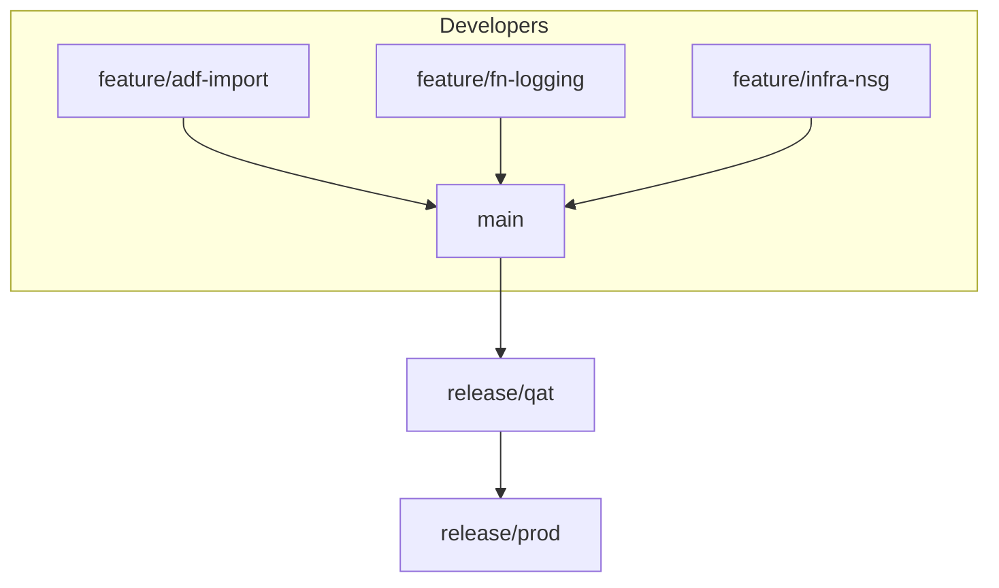

# Branching Strategy

A clear and enforceable branching strategy is critical for quality, traceability, and velocity in a DevOps environment. This strategy uses a trunk-based model with structured promotion branches to align with GitHub Actions CI/CD and enterprise practices.

## Branch Types

| Branch          | Purpose                                    | Lifecycle                              |
|------------------|--------------------------------------------|----------------------------------------|
| `main`           | Trunk for development integration          | Persistent. All features merge here.   |
| `release/qat`    | Promotion branch for QA testing            | Created at sprint end, retired post-QA |
| `release/prod`   | Production-ready branch                    | Persistent, updated via PR from QAT    |
| `feature/*`      | Isolated feature or fix development        | Short-lived, PR into `main`            |
| `hotfix/*`       | Emergency production fixes                 | PR into `release/prod`, backported     |

## Flow Diagram

## Merge Rules

- All PRs must go through `main` unless it's an emergency fix
- Merge into `main` triggers deployment to `dev`
- Promote to `release/qat` for staging/QAT
- After QA approval, PR to `release/prod`

## Branch Protections

| Branch         | Protection Settings                                                  |
|----------------|-----------------------------------------------------------------------|
| `main`         | Require PRs, status checks, 1+ reviewers                              |
| `release/qat`  | Require PRs, optional approvals, scoped deploy permissions           |
| `release/prod` | Require PRs, required reviewers, required status checks + environments|

## Naming Conventions

- `feature/adf-new-pipeline`
- `hotfix/fn-config-bug`
- `release/qat`, `release/prod` (fixed)

## Advantages

- High visibility and traceability
- Smooth promotion to environments
- Parallel feature development
- Minimal merge conflicts
- Aligned with trunk-based development best practices

