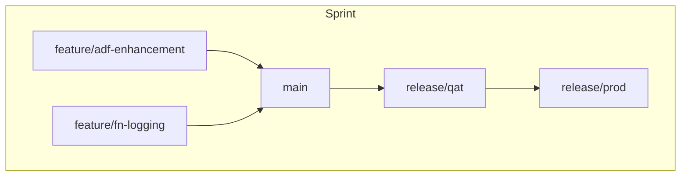

# Sprint Workflow and Delivery Cadence

This document outlines the end-to-end development and deployment flow across a typical 2-week sprint cycle using GitHub Actions and promotion branches.

## Sprint Cadence Overview

| Phase         | Days     | Actions |
|---------------|----------|---------|
| Planning      | Day 1    | Define stories, epics, goals in GitHub Projects |
| Development   | Day 1–8  | Code on `feature/*` branches |
| PR Review     | Day 6–10 | PRs raised to `main` → run CI + deploy to `test` |
| Merge & Test  | Day 10   | Merge to `main` → auto-deploy to `dev` |
| QA/UAT        | Day 10–12| Create `release/qat` → deploy to `qat`, QA team reviews |
| Prod Release  | Day 13–14| PR from `release/qat` to `release/prod` → deploy to `prod` |
| Retrospective | Day 14   | Review failures, lead times, feedback |

## Workflow Example

## Key Roles

- **Developers:** Code in feature branches
- **Tech Lead:** Approves PRs to `main`, manages QAT branch
- **QA Team:** Tests in `qat`, validates UAT
- **Release Manager:** Approves and merges `release/qat` → `release/prod`

## GitHub Projects Integration

- Create a board per sprint
- Track issues with linked PRs
- Define milestones for each release

## Best Practices

- Keep feature branches < 5 days long
- Create PRs early, iterate with comments
- Do not merge to `main` unless PR checks pass
- Treat `release/qat` as a release candidate snapshot
- Perform final signoff in `qat` before `prod` promotion

